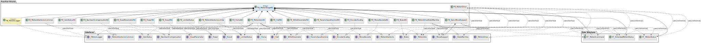

# LCLS New Motion Library

[](docs/motion_library_architecture.svg)

---

## Table of Contents

- [Overview](#overview)
- [Features](#features)
- [Architecture](#architecture)
  - [Core Data Structures](#core-data-structures)
  - [Key Interfaces](#key-interfaces)
  - [Principal Function Blocks](#principal-function-blocks)
  - [Motion Control Function Blocks](#motion-control-function-blocks)
  - [UML Diagram](#uml-diagram)
- [Installation](#installation)
- [Usage](#usage)
  - [Basic Setup](#basic-setup)
  - [Typical Workflow](#typical-workflow)
- [Repository Structure](#repository-structure)
- [Testing](#testing)
- [Documentation](#documentation)
- [Contributing](#contributing)
- [License](#license)
- [Contact](#contact)

---

## Overview

This repository provides the motion control library for the LCLS (Linac Coherent Light Source) and other advanced automation applications. It is built on a modular and object-oriented architecture in Structured Text (ST) for industrial PLCs (TwinCAT, CODESYS, etc.), emphasizing reliability, safety, and flexibility.

The library enables easy integration of hardware or simulation, advanced interlock handling, persistent axis parameters, and detailed diagnostic capabilities.

---

## Features

- **Hardware Agnostic:** Works with physical axes, virtual (simulated) axes, and test setups.
- **Modular Design:** Clearly separated commands, status, safety interlocks, and diagnostics via interfaces and data structures.
- **Extensible:** Supports custom axis types, additional drive logic, real-time logging, and more.
- **Comprehensive Status:** Unified structures for operator commands, real and extended axis status, and error reporting.
- **Standard Motion Control Blocks:** Leverages standardized "MC_" function blocks for OEM hardware compatibility.
- **Advanced Safety:** Integrated interlocks, brake management, and extensive error/warning tracking.
- **EPICS Integration:** Designed for seamless controls integration (used heavily in accelerator physics).

---

## Architecture

The motion library is organized into function blocks (FBs), interfaces, and core data structures. See the UML overview below.

### Core Data Structures

- **`ST_MotionCommand`**: Encapsulates user and system axis commands (move, home, halt, reset, etc.)
- **`ST_MotionStatus`**: Holds real-time axis status, telemetry (position, velocity, limits, error).
- **`ST_ExtendedMotionStatus`**: Extended data for debugging, diagnostics, and unit testing.

All structures are instantiated in `FB_MotionStageNC` and passed by reference to other function blocks (`FB_MotionDrive`, `FB_MotionDriveStateMachine`, `FB_EpicsMoveRequest`) for coordinated state management.

### Key Interfaces

- **`I_MotionAxis`**: Abstracts the underlying axis logic (servo, stepper, simulated).
- **`I_MotionDrive`**: Defines the drive implementation contract.
- **`I_MoveRequest`**: Encapsulates move/home/stop request logic.
- **`I_MotionLogger`**: Decoupled logging and feedback for diagnostics.
- **`I_MotionInterlocks`**, `I_Brake` and others provide specific concerns for safety, brake control, and error handling.

### Principal Function Blocks

- **`FB_MotionStageNC`**: The top-level orchestrator. Instantiates axis, brake, interlocks, logger, and drive logic, and owns the motion data structures.
- **`FB_MotionDrive`**: Core motion algorithm. Coordinates with hardware, interlocks, state machine, and references the motion data structures for centralized state.
- **`FB_MotionDriveStateMachine`**: Manages sequences, transitions, and error recoveries.
- **`FB_EpicsMoveRequest`**: Handles move requests from external control systems (EPICS).

Other major FBs:
- **`FB_MotionAxisNC`, `FB_HomeNC`, `FB_ResetNC`, `FB_PowerNC`, `FB_HaltNC`, `FB_MoveAbsoluteNC`, `FB_BacklashCompensationNC`, ...**  
  Implement command primitives (homing, power, move, halt, etc.), each following interface contracts.

### Motion Control Function Blocks

Standard MC blocks used for hardware abstraction:
- `MC_Home`, `MC_SetPosition`, `MC_MoveAbsolute`, `MC_BacklashCompensation`, `MC_Halt`, `MC_Reset`, `MC_Power`.

### UML Diagram

Below is a summary of the motion library architecture.  
Click for full resolution.

[](docs/motion_library_architecture.svg)

---

## Installation

1. **Clone the repository:**
   ```bash
   git clone https://github.com/yannS2016/lcls-new-motion.git
```
## Usage
Below is a sample boiler plate for the motion library. it shows how to create the logger, persistent data storage, axis reference, and motion stage, then call them in the main PLC cycle.
## Basic Usage
```pascal
VAR
    fbMotionLogger           : FB_MotionLogger;
    fbPersistentDataStorage  : FB_PersistentDataStorage;
    fbAxisRef                : FB_MotionAxisNC; // Replace with your axis implementation

    fbMotionStage : FB_MotionStageNC(
        sName                   := 'Test2',                  // Name identifier for the motion stage
        AxisRef                 := fbAxisRef,                // Reference to the axis function block
        iMotionLogger           := fbMotionLogger,           // Logger interface
        iPersistentDataStorage  := fbPersistentDataStorage   // Persistent data storage interface
    );
END_VAR

// Typical PLC cycle invocation
fbPersistentDataStorage();
fbMotionLogger();
fbMotionStage();
```
### Typical Workflow

- Logger (FB_MotionLogger): Handles motion-related diagnostics, warnings, and error reporting.
- Persistent Data Storage (FB_PersistentDataStorage): Manages saving and restoring axis parameters and motion state across controller cycles.
- Axis Reference (FB_MotionAxisNC): Represents the underlying axis being controlled—select or replace as appropriate for your hardware.
- Motion Stage (FB_MotionStageNC): The main orchestrator, bringing together axis logic, logging, persistent storage, and command/state coordination.
- All function blocks are called cyclically in the PLC program, ensuring continual updates and coordination
